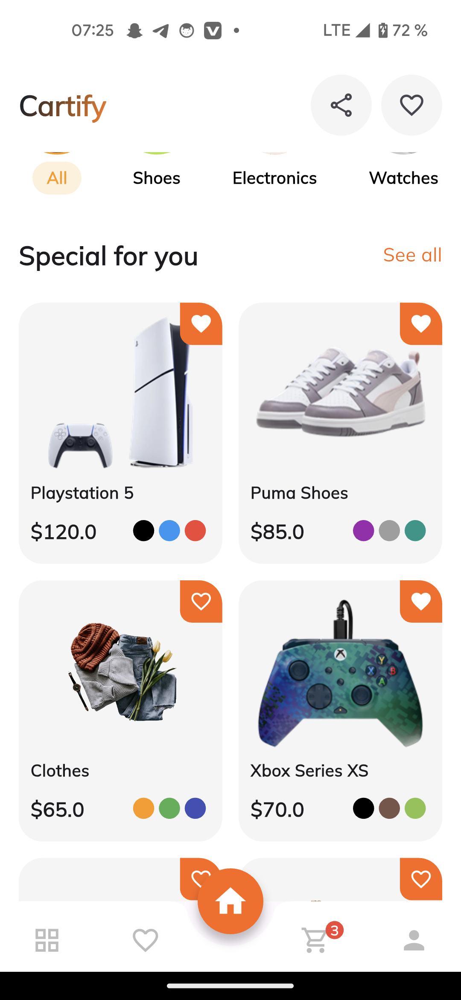
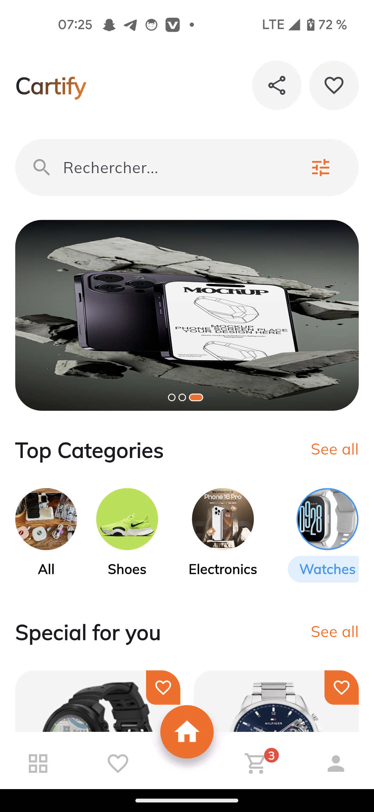
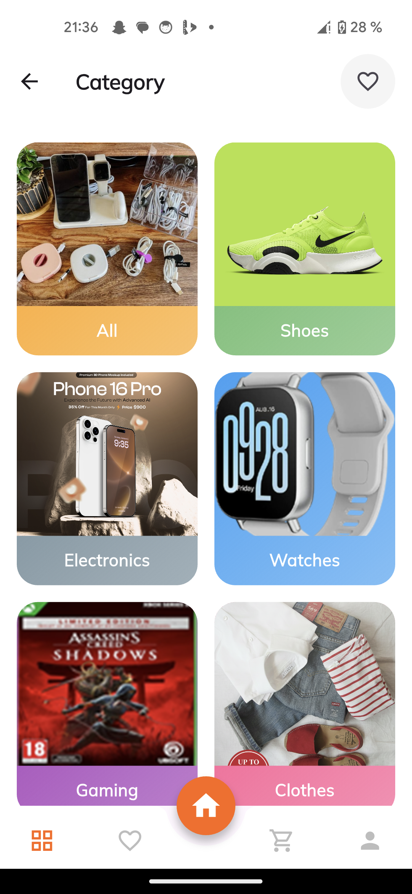
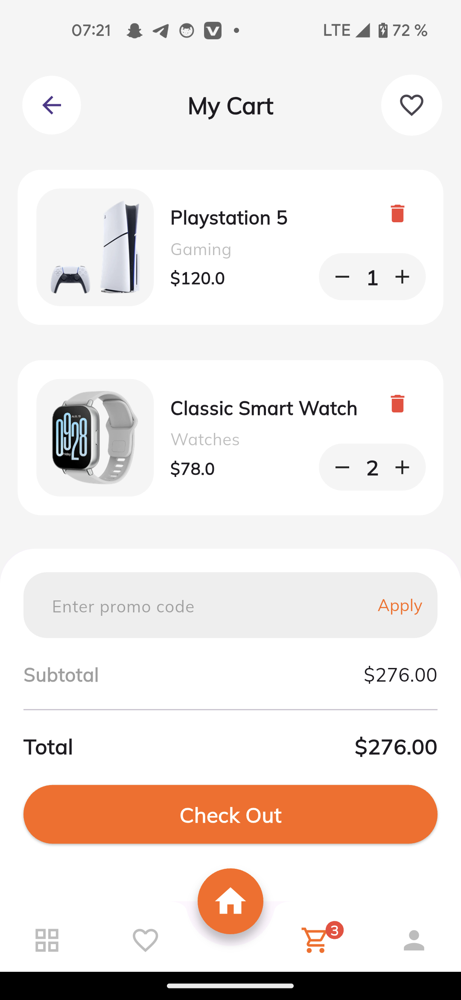
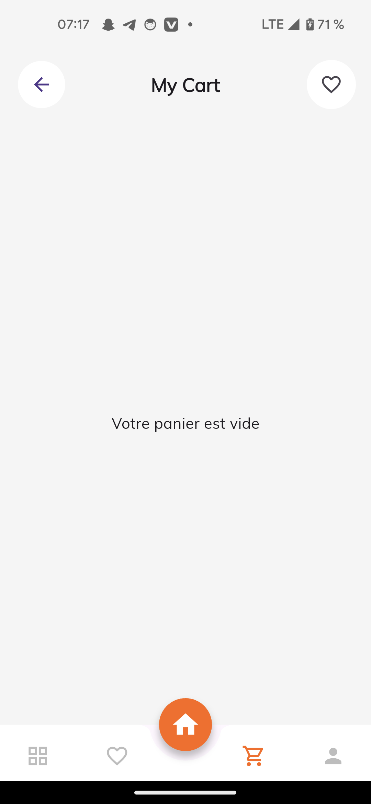
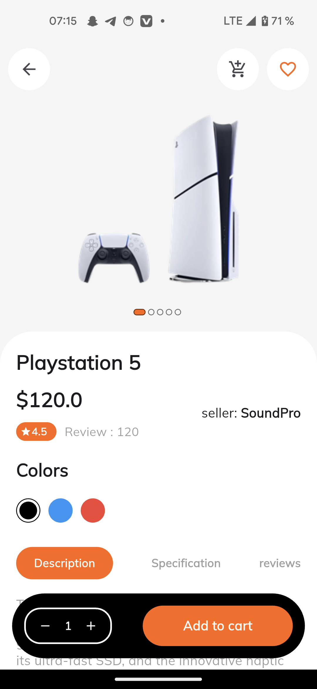
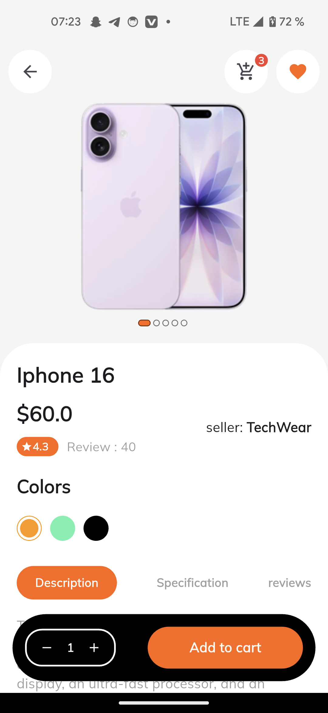
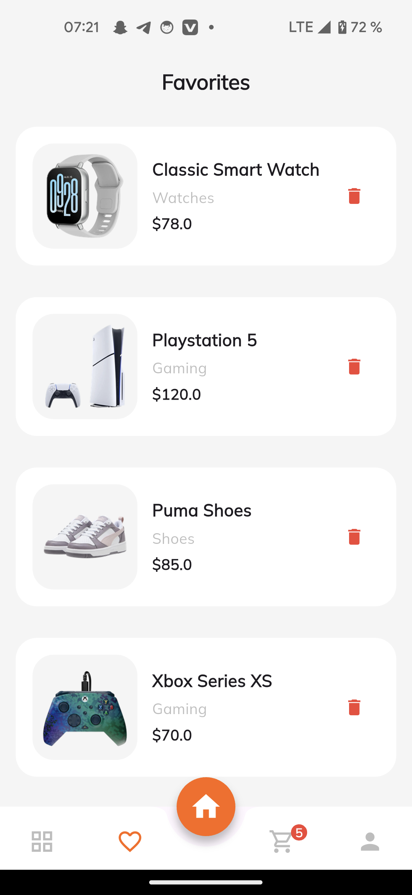
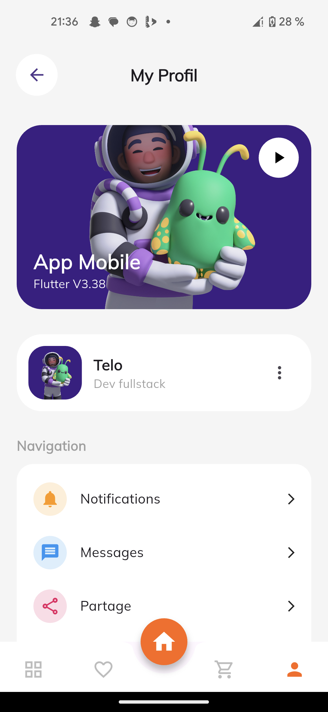
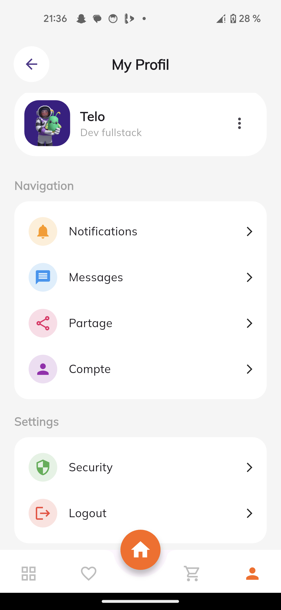

# Mini App E-Commerce Flutter

[](https://flutter.dev/)

## Description
Mini App E-Commerce (Cartify) est une application mobile développée avec **Flutter** permettant de parcourir des produits, les ajouter au panier, gérer les favoris et passer des commandes. Cette application est conçue comme un **prototype léger** d’une boutique en ligne.


## Objectif

L’objectif de ce projet est de développer une **application mobile e-commerce complète** en Flutter, permettant de gérer :

- La liste de produits
- Le panier des utilisateurs
- Les produits favoris

Ce projet, bien qu’étant une initiative personnelle, est rendu public pour :

- **Partager une architecture propre et réutilisable**, adaptée aux projets Flutter modulaires.
- **Servir de référence ou d’inspiration** à d’autres développeurs souhaitant créer une application e-commerce.

Status : En cours de developpement

---

## Fonctionnalités principales

- Affichage des produits avec images, prix et descriptions
- Recherche et filtrage des produits (à venir)
- Gestion du panier (ajout, suppression, quantité)
- Gestion des favoris
- Navigation fluide entre les écrans (Home, Détail produit, Panier, Favoris)
- Compatible Android et iOS

---

## Screenshots

<table>
<tr>
<td></td>
<td></td>
<td></td>
<td></td>
</tr>
<tr>
<td></td>
<td></td>
<td></td>
<td></td>
</tr>
<tr>
<td></td>
<td></td>
<td></td>
<td></td>
</tr>
</table>

---
## Installation

1. Cloner le repository :
```bash
git clone https://github.com/SamiTelo/App_mobile_flutter.git
cd App_mobile_flutter
Installer les dépendances Flutter :

bash
Copier le code
flutter pub get
Lancer l’application sur un émulateur ou appareil connecté :

bash
Copier le code
flutter run

Packages utilisés
flutter/material.dart

provider (pour la gestion d’état)


Licence
Ce projet est sous licence MIT.

Auteur
Samuel TIEMTORE

Contact : samueltiemtore10@gmail.com

---
